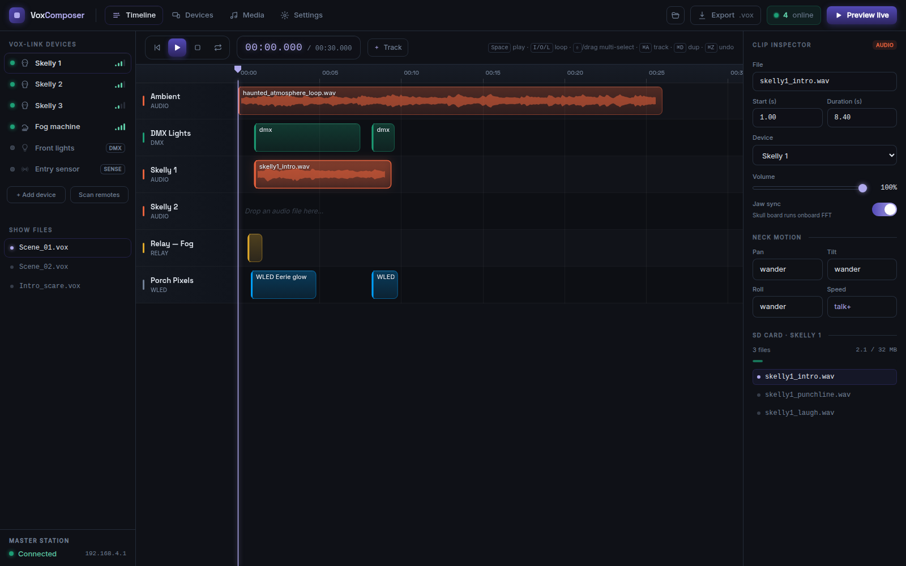

# Vox Composer

**Design and play synchronized animatronic shows for haunted attractions** — a browser-based PWA
for the VOX ecosystem of wireless remotes.

🎃 **Live demo:** <https://voxcomposer.app/demo/> · 📖 Docs: voxcomposer.com · MIT licensed



Vox Composer is a frame-accurate, multi-track timeline editor for choreographing skulls, lights,
fog, and audio across a yard full of wireless remotes — then playing the whole show back in sync.
It runs entirely in the browser, works fully offline, and talks to a local **Vox Master** station
over Wi-Fi to drive the remotes via **Vox-Link**.

## Highlights

- **Custom Canvas timeline** — frame-accurate, GPU-light, not a generic drag-and-drop library.
  Drag/resize/snap clips, multi-select (shift-click + rubber-band), group move, undo/redo,
  copy/paste, loop regions, and a dirty-flagged render loop that never re-renders React at frame
  rate.
- **Real audio** — drag in `.mp3/.wav/.ogg/.m4a`; the browser decodes for waveforms and local
  preview playback. MP3 is first-class — files transcode to WAV server-side only at sync time, for
  remotes whose firmware needs it.
- **Devices dashboard** — live status, signal strength, battery, SD usage, firmware, and the audio
  spec each remote's codec requires.
- **Media library** — every clip with its waveform, format badge, and sync state.
- **Plugins** — a real SDK (`@voxcomposer/plugin-sdk`) with built-in **WLED**, **Generic HTTP**, and
  **Generic UDP** integrations. Plugins add custom track types, render their own inspector UI, and
  fire side effects each frame.
- **Offline-first PWA** — installable, with IndexedDB persistence of your show *and* imported audio.
- **`.vox` files** — human-readable JSON, versioned, with automatic migration on load.

## Monorepo layout

```
apps/
  web/            React 18 + TS + Vite + Tailwind PWA — the editor
  server/         Node + Express + Prisma + Socket.io (planned)
packages/
  shared/         The .vox schema (zod-first), Vox-Link protocol, migrations
  plugin-sdk/     Plugin SDK published to npm
examples/plugins/ WLED + Generic HTTP plugin templates
```

## Quick start (developers)

Requires **Node 22+** and **pnpm 9+**.

```bash
pnpm install
pnpm dev          # starts the web app on http://localhost:5173
```

Other useful scripts (run from the repo root):

```bash
pnpm typecheck    # tsc across every package
pnpm test         # vitest across every package
pnpm build        # production build of the web app (+ PWA service worker)
pnpm lint
```

## Quick start (self-hosting)

The editor is a static SPA and needs no backend for the full editing workflow. To host the demo:

```bash
pnpm --filter @voxcomposer/web build
# serve apps/web/dist/ with any static host (nginx, Caddy, Netlify, Pages…)
```

Because the app uses hash-based routing and a relative asset base (`base: './'`), it works under any
subpath with no server rewrites. Cloud sync, accounts, and media transcoding are additive and live
in `apps/server` (not built yet) — see `docs/self-hosting.md` when it lands.

> **Media stays local by design.** Audio lives in the browser (IndexedDB) and on the local network
> (Master → SD cards). The server only ever stores the small `.vox` JSON — no media bandwidth bills.

## Writing a plugin

Plugins are authored with `@voxcomposer/plugin-sdk` and run trusted, in-process:

```ts
import { definePlugin } from '@voxcomposer/plugin-sdk';

export default definePlugin({
  id: 'com.example.strobe',
  name: 'Strobe',
  version: '1.0.0',
  author: 'you',
  description: 'Fire a strobe over HTTP',
  trackType: 'strobe',
  permissions: ['network'],
  color: '#FFD166',
  summarizeClip: (clip) => `Strobe ${clip.data.bursts ?? 1}×`,
  onFrame: (_ts, clip, api) => void api.sendHTTP(`http://${clip.data.host}/burst`),
});
```

See [`examples/plugins/`](examples/plugins) for complete WLED and Generic HTTP examples, and
[CONTRIBUTING.md](CONTRIBUTING.md) for the full plugin API.

## Status

Early but very much alive — the editor, plugin system, audio pipeline, and PWA are working today.
The backend (accounts, S3 project sync, live preview over Socket.io, file sync to remotes, and
server-side MP3→WAV transcoding) is the next major build. See [CLAUDE.md](CLAUDE.md) for the running
architecture notes.

## License

[MIT](LICENSE) © Shane Rehm / rehmlights
