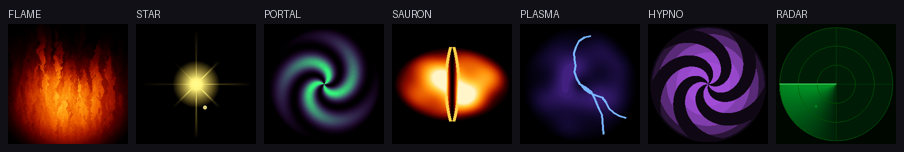

# Starter eye GIFs

Ready-to-use animated eyes for the **OcularVox** skulls — a flame, a star, a
portal, and friends to show where an eyeball would normally be.

| File | What it is |
|---|---|
| `flame.gif` | Doom-fire flame, fading to a round fiery orb |
| `star.gif` | Twinkling gold star with shimmering rays |
| `portal.gif` | Swirling purple/green haunted portal |
| `sauron.gif` | Fiery almond eye with a glowing vertical slit |
| `plasma.gif` | Crackling electric plasma + lightning arcs |
| `hypno.gif` | Rotating hypnotic spiral |
| `radar.gif` | Green sci-fi radar sweep with blips |

All are **232×232** (the round LCD size), palette-optimized, seamless loops
where it matters, and verified to decode pixel-perfect through the skull's own
GIF decoder.

## Using them

- **From Vox Composer:** open a skull's card in **Devices → ✦ Animated eye**,
  drop a GIF (any size — it auto-fits 232×232 and re-encodes), and upload. It
  lands in the skull's SD `/eyes/` and shows up as a selectable eye by name.
- **By hand:** copy a `.gif` into `/eyes/` on the skull's SD card. It registers
  on the next scan and selects by its filename (e.g. `flame.gif` → "flame").

## Limits (the skull's decoder)

- **≤ 232×232** (bigger is rejected — the Composer auto-downscales for you).
- ≤ 256 colours/frame (GIF native); keep files under ~1 MB so they stream
  smoothly off the SD card.
- Disposal 0/1/2 fully supported; mode 3 falls back to mode 2.

These were generated procedurally (see the eye-GIF tooling in the project
history); drop your own in here too.
